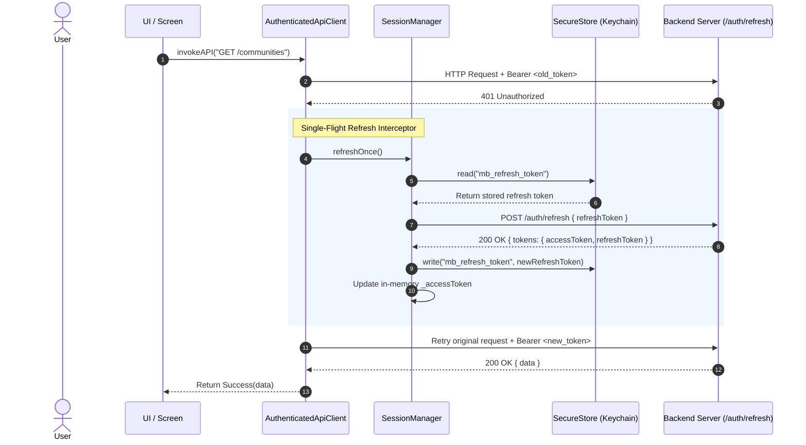

# Authentication, Session & Token Lifecycle Architecture

## 1. Architectural Strategy: Split Token Boundary

The Durvaeco authentication architecture strictly separates credential lifecycles to guarantee security:

```text
┌────────────────────────────────────────────────────────┐
│                      ACCESS TOKEN                      │
│ - Lifetime: Short-lived (e.g. 15 minutes)              │
│ - Storage: RAM / In-Memory ONLY (SessionManager)       │
│ - Disk Persistence: NEVER written to disk              │
│ - Transmission: Header 'Authorization: Bearer <token>' │
└────────────────────────────────────────────────────────┘

┌────────────────────────────────────────────────────────┐
│                     REFRESH TOKEN                      │
│ - Lifetime: Long-lived (e.g. 30 days)                  │
│ - Storage: Hardware Encrypted (Keychain / Keystore)    │
│ - Boundary: SecureStore -> FlutterSecureStore          │
│ - Usage: Exclusively used during 401 refresh rotation  │
└────────────────────────────────────────────────────────┘
```

---

## 2. Token Refresh & Single-Flight Retry Flow

When an API request returns `401 Unauthorized`, `AuthenticatedApiClient` intercepts the response and triggers a single-flight refresh via `SessionManager`:



### Key Safety Invariants:
1. **Single-Flight Lock**: `SessionManager._refreshInFlight` prevents concurrent 401s from issuing multiple refresh requests simultaneously. All pending requests await the exact same Future.
2. **Infinite Loop Protection**: `_isAuthEndpoint(path)` prevents `/auth/login`, `/auth/register`, and `/auth/refresh` from triggering the 401 retry interceptor.
3. **Automatic Invalidation**: If `/auth/refresh` returns 401 (e.g. token revoked or replayed), `SessionManager.clear()` purges credentials and triggers `onInvalidated()`, which sets `AuthState(status: unauthenticated)` and navigates the user to `/login`.

---

## 3. App Startup & Session Bootstrap Flow

To eliminate UI flickering (e.g. flashing the Login screen before stored credentials load), `AuthController` initializes with `AuthStatus.unknown`:

```text
                  App Launch
                      │
                      ▼
         AuthController Initialized
          (status: AuthStatus.unknown)
                      │
                      ▼
            GoRouter redirect:
      (status == unknown ? return null)
          (Splash / Loader visible)
                      │
                      ▼
         AuthRepository.currentUser()
                      │
        ┌─────────────┴─────────────┐
        ▼                           ▼
Has Stored Refresh Token?       No Token / Invalid
        │                           │
        ▼                           ▼
SessionManager.refreshOnce()    status = unauthenticated
        │                           │
        ▼                           ▼
GET /auth/me -> 200 OK          GoRouter redirect:
        │                       -> /login
        ▼
status = authenticated
(user: AuthenticatedUserDto)
        │
        ▼
GoRouter redirect:
-> /home
```

---

## 4. Auth State Implementation Pattern

```dart
enum AuthStatus { unknown, authenticated, unauthenticated }

class AuthState {
  const AuthState({required this.status, this.user});
  const AuthState.unknown() : this(status: AuthStatus.unknown);

  final AuthStatus status;
  final AuthenticatedUserDto? user;

  bool get isAuthenticated => status == AuthStatus.authenticated;
}
```
